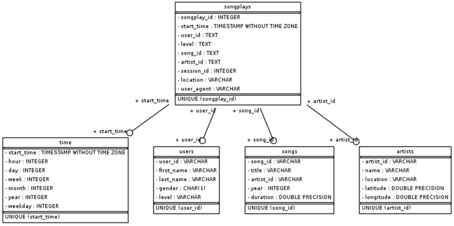

# Project #1 - Data Modeling with postgres  

### Summary
In this project, JSON song data on log data from users is processed and saved into SQL databases. The following dimension tables are created: Artists, Songs, Users, and Time. The fact table songplays contains information on which song was played when by which user, building on the dimension tables applying the schema.

### Context: Sparkify
With the derived database and from the JSON data files, Sparkify can conduct further analyses. For example, they can analyze which songs or artists are played the most or at which time of the day or week users listen to music the most. With further data on the songs, Sparkify might aim to optimize the song playlist by analyzing which songs are most likely to be played (and liked) by users.

### File description:
- `create_tables.py`: drops and recreates all tables used in this exercise; run at start
- `test.ipynb`: includes tests and sanity checks provided by Udacity
- `etl.py`: main script to process song and log data
- `etl.ipynb`: step by step processing to build pipeline (pre-work for `etl.py`)
- `sql_queries.py`: includes sql statements to call in other scripts

### How to Use:
- Clear all tables by running `create_tables.py`
- Process data by running `etl.py`
- Conduct test using `test.ipynb`

### ER diagram:

