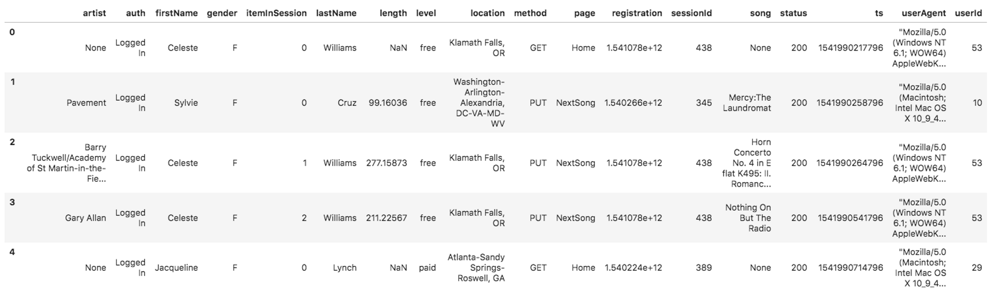

# 2.4 Project - Data Warehouse with AWS Redshift

## Introduction

A music streaming startup, Sparkify, has grown their user base and song database and want to move their processes and data onto the cloud. Their data resides in S3, in a directory of JSON logs on user activity on the app, as well as a directory with JSON metadata on the songs in their app.

As their data engineer, we build an ETL pipeline that extracts their data from S3, stages them in Redshift, and transforms data into a set of dimensional tables for their analytics team to continue finding insights into what songs their users are listening to.

## Project Description

In this project, we apply what we've learned on data warehouses and AWS to build an ETL pipeline for a database hosted on Redshift. We load data from S3 to staging tables on Redshift and execute SQL statements that create the analytics tables from these staging tables.

## Project Datasets

We with two datasets that reside in S3. Here are the S3 links for each:

- Song data: `s3://udacity-dend/song_data`
- Log data: `s3://udacity-dend/log_data`

Log data json path: `s3://udacity-dend/log_json_path.json` (provides info on JSON format of log data)

### Song Dataset

The first dataset is a subset of real data from the Million Song Dataset. Each file is in JSON format and contains metadata about a song and the artist of that song. The files are partitioned by the first three letters of each song's track ID. For example, here are file paths to two files in this dataset.

`song_data/A/B/C/TRABCEI128F424C983.json`
`song_data/A/A/B/TRAABJL12903CDCF1A.json`

And below is an example of what a single song file, TRAABJL12903CDCF1A.json, looks like.

`{"num_songs": 1, "artist_id": "ARJIE2Y1187B994AB7", "artist_latitude": null, "artist_longitude": null, "artist_location": "", "artist_name": "Line Renaud", "song_id": "SOUPIRU12A6D4FA1E1", "title": "Der Kleine Dompfaff", "duration": 152.92036, "year": 0}`

### Log Dataset

The second dataset consists of log files in JSON format generated by this event simulator based on the songs in the dataset above. These simulate app activity logs from an imaginary music streaming app based on configuration settings.

The log files in the dataset you'll be working with are partitioned by year and month. For example, here are file paths to two files in this dataset.

`log_data/2018/11/2018-11-12-events.json`
`log_data/2018/11/2018-11-13-events.json`

And below is an example of what the data in a log file, `2018-11-12-events.json`, looks like.

## Schema for Song Play Analysis

Using the song and event datasets, we create a star schema optimized for queries on song play analysis. This includes the following tables.

#### Fact Table

- `songplays` - records in event data associated with song plays i.e. records with page NextSong 
    - songplay_id, start_time, user_id, level, song_id, artist_id, session_id, location, user_agent

#### Dimension Tables

- `users` - users in the app
  - user_id, first_name, last_name, gender, level
- `songs` - songs in music database
  - song_id, title, artist_id, year, duration
- `artists` - artists in music database
  - artist_id, name, location, latitude, longitude
- `time` - timestamps of records in songplays broken down into specific units
  - start_time, hour, day, week, month, year, weekday

## Project Files

- `create_tables.py`
  - Here we create the fact and dimension tables for the star schema in Redshift
- `etl.py`
  - Here we load data from S3 into staging tables on Redshift and then process that data into analytics tables on Redshift
- `sql_queries.py` 
  - Here we define SQL statements which will be imported into the two other files above
- `dwh.cfg`
  - Here we define the config parameters used (IAM role, Redshift cluster metadata, S3 data) - must be created and filled with credentials

## How to run the project

1. Fill config file `dwh.cfg` with required config parameters
2. Create Redshift cluster with and add parameters to `dwh.cfg`
3. Run `create_tables.py` to create all required tables
4. Run `etl.py` to load data from S3 into staging tables on Redshift and process into star schema table set
5. Try out queries :)